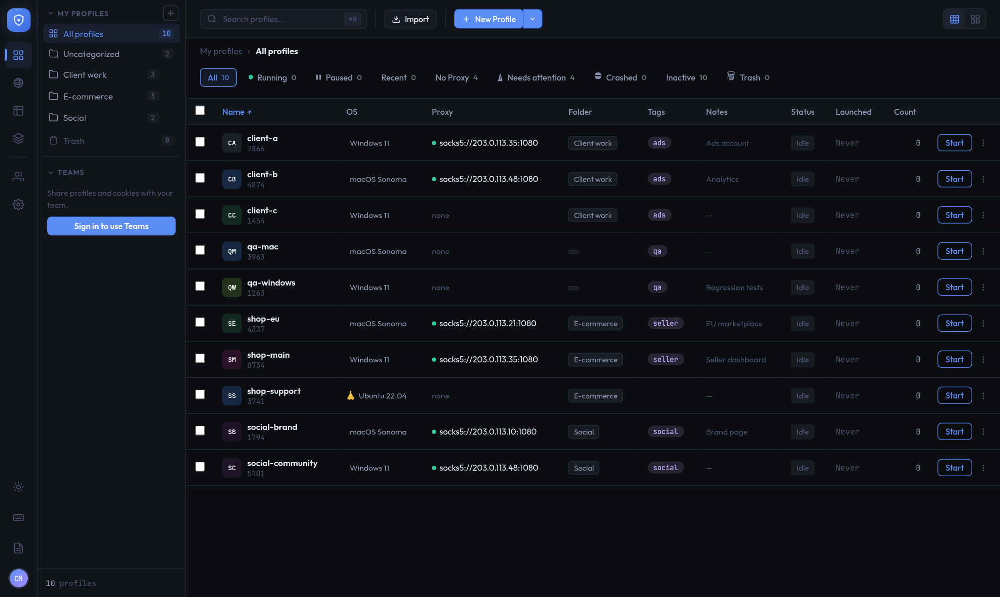

  <picture>
    <source media="(prefers-color-scheme: dark)" srcset="https://raw.githubusercontent.com/Gee2424/ctrldlogin/main/assets/logo-dark.svg">
    
  </picture>

  <strong>Isolated browser profiles with unique fingerprints — for Windows, macOS and Linux.</strong>

  
  
  

---

**ctrldlogin** lets you run many separate browser identities from one desktop app. Each profile has its own fingerprint, proxy, cookies and storage, so every session looks like a distinct device. Share profiles with your team, automate routine tasks, and move cookies in and out in the formats you already use.

  

## Download

Get the latest version from **[Releases](https://github.com/Gee2424/ctrldlogin/releases/latest)**:

| System | File |
|--------|------|
| Windows 10/11 (64-bit) | `ctrldlogin_<version>_x64-setup.exe` |
| macOS (Apple Silicon) | `ctrldlogin_<version>_aarch64.dmg` |
| Linux | `.AppImage`, `.deb` or `.rpm` |

The browser engine (~200 MB) downloads automatically the first time you launch a profile. The app isn't code-signed yet — see [Getting Started](https://gee2424.github.io/ctrldlogin/getting-started#installation) for the one-time Windows/macOS prompt.

## Features

- **Profiles** — create, clone, reset, search, organise in folders; bulk actions; Trash
- **Fingerprinting** — platform, browser brand, GPU, CPU, memory, screen, timezone, language, location and WebRTC IP per profile (CloakBrowser engine)
- **Proxies** — HTTP/SOCKS5, bulk import, connectivity test; launches stop if the proxy fails
- **Cookies** — import/export JSON, Playwright, Cookie-Editor, Netscape; ZIP for many profiles
- **Teams** — share profiles with roles and per-person access, shared proxies, optional cookie sync
- **Automation** — rules on a schedule, an interval or profile events
- **Extensions** — CRX/ZIP upload or Chrome Web Store import, per profile
- **Local API** — script it and drive profiles with Playwright over CDP

## Pricing

Free plan with 15 profiles, no account needed. Paid plans — **Starter $3**, **Pro $6**, **Business $9** per month (or 10× per year) — raise the limits and add the activity log, pause/resume and cloning. Paid in Bitcoin from inside the app. See **[Pricing](https://gee2424.github.io/ctrldlogin/pricing)**.

## Documentation

**[gee2424.github.io/ctrldlogin](https://gee2424.github.io/ctrldlogin/)** — [Getting Started](https://gee2424.github.io/ctrldlogin/getting-started) · [Features](https://gee2424.github.io/ctrldlogin/features) · [Teams](https://gee2424.github.io/ctrldlogin/teams) · [FAQ](https://gee2424.github.io/ctrldlogin/faq) · [Changelog](https://gee2424.github.io/ctrldlogin/changelog) · [Privacy](https://gee2424.github.io/ctrldlogin/privacy) · [Terms](https://gee2424.github.io/ctrldlogin/terms) · [Refunds](https://gee2424.github.io/ctrldlogin/refund)

## Support

Report problems on the [issue tracker](https://github.com/Gee2424/ctrldlogin/issues) or email **gkm18686@gmail.com**.

## License

ctrldlogin is closed-source commercial software. See the [Software License Agreement](LICENSE) and the [Terms of Service](https://gee2424.github.io/ctrldlogin/terms).

<em>For legitimate privacy, testing and account-management use only.</em>

