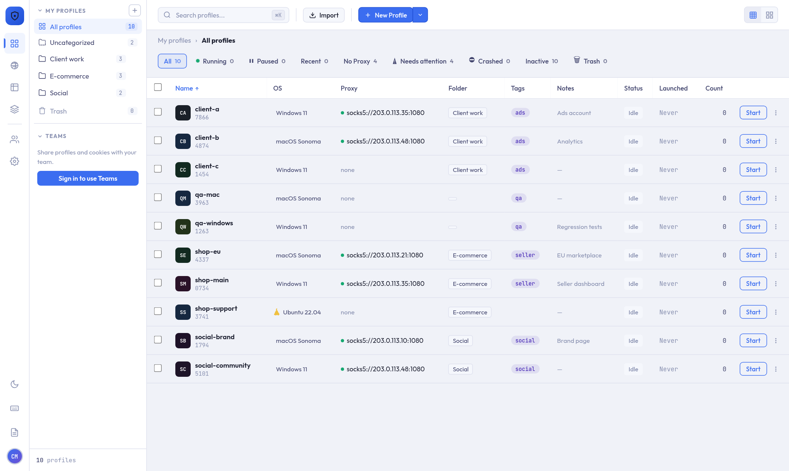

# Getting Started



## System Requirements

<div class="grid" style="display: grid; grid-template-columns: repeat(auto-fit, minmax(200px, 1fr)); gap: 1rem; margin: 1.5rem 0;">

<div style="border: 1px solid var(--vp-c-border); border-radius: 10px; padding: 1.25rem;">
<h4 style="margin: 0 0 0.5rem;">🪟 Windows</h4>
<p style="margin: 0; font-size: 0.875rem;">Windows 10 or 11<br><small>64-bit</small></p>
</div>

<div style="border: 1px solid var(--vp-c-border); border-radius: 10px; padding: 1.25rem;">
<h4 style="margin: 0 0 0.5rem;">🍎 macOS</h4>
<p style="margin: 0; font-size: 0.875rem;">Apple Silicon Mac (M1 or newer)<br><small>No Intel build at the moment</small></p>
</div>

<div style="border: 1px solid var(--vp-c-border); border-radius: 10px; padding: 1.25rem;">
<h4 style="margin: 0 0 0.5rem;">🐧 Linux</h4>
<p style="margin: 0; font-size: 0.875rem;">Ubuntu 22.04+, Debian 12+, Fedora 36+ or similar<br><small>x86-64, glibc 2.35+</small></p>
</div>

</div>

At least **4 GB RAM** and **1 GB free disk space**. The browser engine (~200 MB) downloads automatically the first time you launch a profile; each profile then uses its own space for cookies, cache and history.

## Download

Get the latest version from the **[Releases page](https://github.com/Gee2424/ctrldlogin/releases/latest)** — download the one file for your system:

| System | File | Size |
|--------|------|------|
| Windows | `ctrldlogin_<version>_x64-setup.exe` | ~45 MB |
| macOS (Apple Silicon) | `ctrldlogin_<version>_aarch64.dmg` | ~50 MB |
| Linux — any distro | `ctrldlogin_<version>_amd64.AppImage` | ~160 MB |
| Linux — Debian / Ubuntu | `ctrldlogin_<version>_amd64.deb` | ~97 MB |
| Linux — Fedora / RHEL | `ctrldlogin-<version>-1.x86_64.rpm` | ~97 MB |

> `ctrldlogin-backend-windows.zip` on the same page is a developer component — you don't need it.

## Installation

### Windows

1. Run `ctrldlogin_<version>_x64-setup.exe` and follow the installer.
2. The app isn't code-signed yet, so Windows SmartScreen may say *"Windows protected your PC"*. Click **More info → Run anyway** (only the first time).

### macOS

1. Open the `.dmg` and drag **ctrldlogin** into **Applications**.
2. The app isn't notarized by Apple yet. If macOS blocks it, open **System Settings → Privacy & Security** and click **Open Anyway** next to the ctrldlogin message — only needed once.

### Linux

**AppImage** (any distribution):
```bash
chmod +x ctrldlogin_*_amd64.AppImage
./ctrldlogin_*_amd64.AppImage
```
If it won't start on Ubuntu, install FUSE 2: `sudo apt install libfuse2` (Ubuntu 24.04: `libfuse2t64`).

**Debian / Ubuntu:**
```bash
sudo apt install ./ctrldlogin_*_amd64.deb
```

**Fedora / RHEL:**
```bash
sudo dnf install ./ctrldlogin-*.x86_64.rpm
```

---

## First Launch

1. **Open ctrldlogin.** No account is needed for the Free plan.
2. **Create a profile** — click **New Profile**, give it a name (letters, numbers, `-` and `_`), and pick the operating system it should look like (Windows, macOS or Linux). Each profile gets its own fingerprint seed; you can fine-tune screen, language, timezone and more in the profile settings.
3. **Launch it** — the first launch downloads the browser engine (~200 MB, one time). A browser window opens with that profile's own fingerprint, cookies and storage.

### Add a Proxy (optional)

1. Open **Proxies → Add Proxy** (HTTP or SOCKS5), or paste many at once with **Bulk import**.
2. Use **Test** to check it works and see its exit IP.
3. Assign it to a profile. The proxy is tested on every launch, and the profile's WebRTC IP is set to the proxy's exit IP. If the proxy is down, the launch is stopped instead of falling back to your real connection.

### Check the Fingerprint

Launch a profile and use **Fingerprint test** (or visit [browserscan.net](https://browserscan.net)) to see what websites detect.

## Upgrading to a Paid Plan

Open **Settings → Billing**, sign in or create an account, choose a plan and pay with Bitcoin on the checkout page. The plan switches on in the app by itself once the payment confirms. Details on the [Pricing](/pricing) page.

## Where Your Data Lives

Profiles, settings and browser data stay on your computer:

| System | Location |
|--------|----------|
| Windows | `%APPDATA%\ctrldlogin\` |
| macOS | `~/Library/Application Support/ctrldlogin/` |
| Linux | `~/.local/share/ctrldlogin/` |

Back up or move your profiles by copying this folder (with the app closed).

## Updating

There's no automatic updater yet. Download the newest release and install it over the old one — your profiles and settings are kept, because they live in the folder above, not in the app.

## Next Steps

- Explore [all features](/features)
- Share profiles with your team — see [Team Profile Sharing](/teams)
- Compare [plans and pricing](/pricing)
- Check the [FAQ](/faq)
